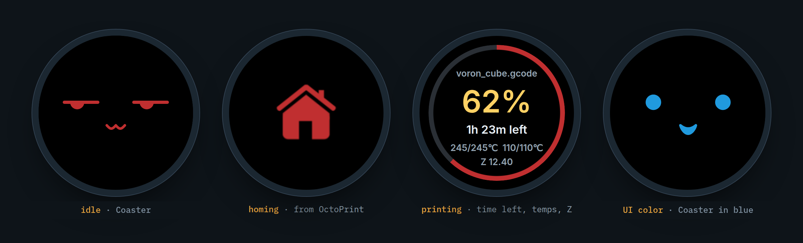
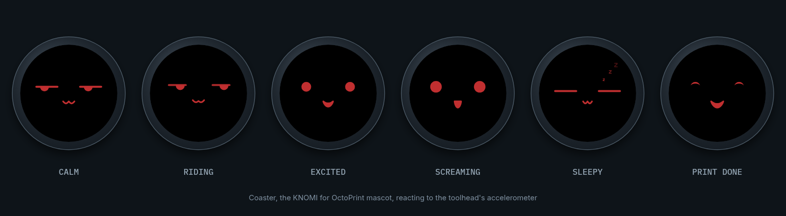
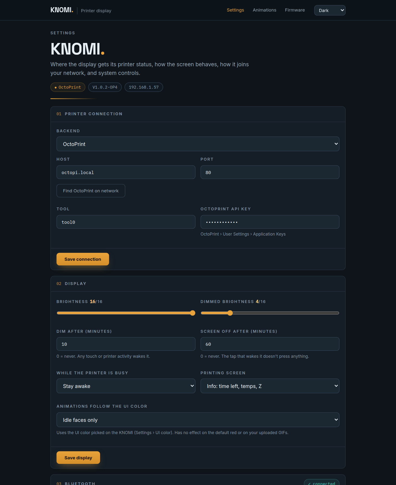
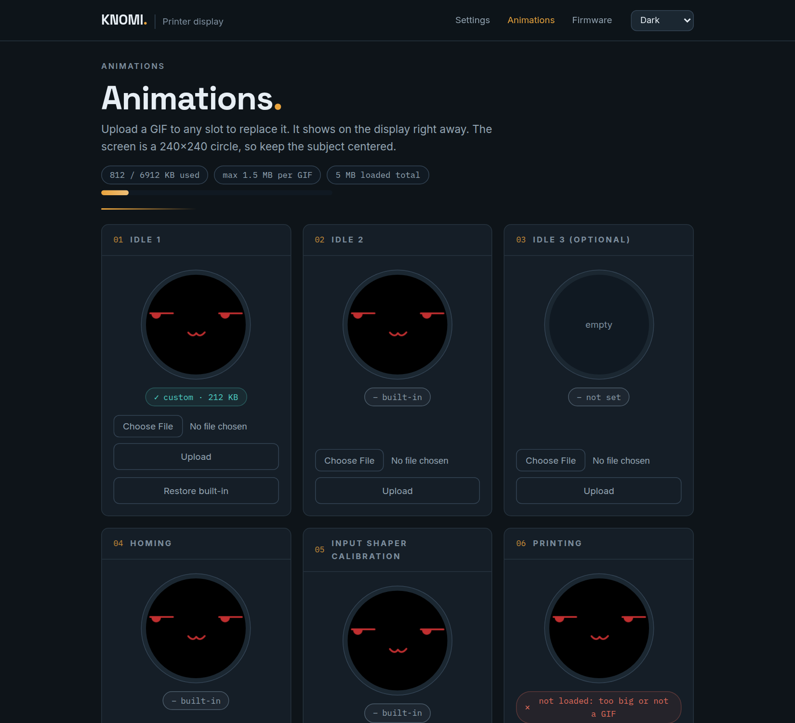
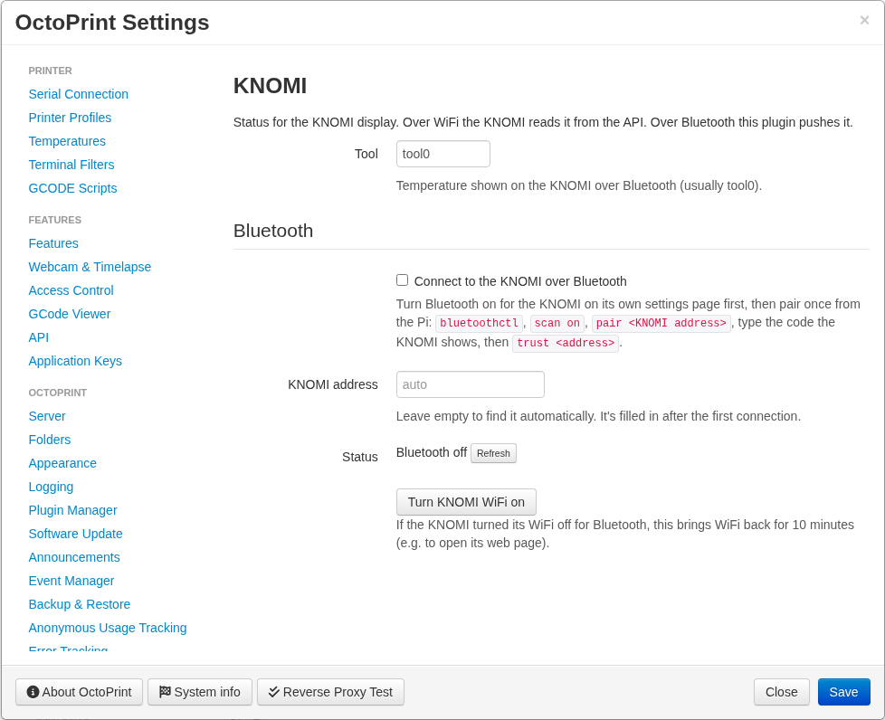

# KNOMI for OctoPrint: custom BTT KNOMI 2 firmware for OctoPrint and Klipper

**Run the BigTreeTech KNOMI / KNOMI 2 display with OctoPrint.** The stock KNOMI firmware only talks to Moonraker (Mainsail/Fluidd). This fork adds a full OctoPrint backend, so the round Voron Stealthburner display works with **OctoPrint + OctoKlipper**. It also still supports Moonraker.

<p align="center"></p>

> [!IMPORTANT]
> **Only tested on a KNOMI 2 with OctoPrint on a Raspberry Pi 5.** The KNOMI 1 build compiles but hasn't been tested on hardware, and neither have other Pi models or hosts. Reports and PRs are welcome.

Companion plugin: **[OctoPrint-KNOMI](https://github.com/Binnacle-Tech/OctoPrint-KNOMI)** (needed for the homing / QGL / bed mesh / pause animations and for Bluetooth).

## Meet Coaster

<p align="center"></p>

Coaster is this firmware's mascot and every face on the KNOMI. Instead of looping a GIF, it's drawn live from the KNOMI 2's accelerometer, so it rides along with your toolhead. Its eyes slosh with every move. It gets excited on fast moves and screams on hard travel, then gets used to it. It flinches at endstop hits, shivers through input shaper tests, rides the elevator during QGL and dozes off when nothing moves. It also sweats when the nozzle is hot and celebrates when a print finishes. Tune how it reacts on the KNOMI's **Coaster face** page, or put it on your print screen in the designer.

## Features

- **OctoPrint support.** Temps, progress, file list, print/pause/resume/cancel, preheat, extrude, home, QGL and bed mesh from the KNOMI touchscreen, authenticated with an OctoPrint application key.
- **Live updates** over OctoPrint's websocket (push, not polling), with an HTTP fallback.
- **Find OctoPrint on network.** One click on the settings page finds OctoPrint over mDNS.
- **Bluetooth LE link** to the plugin (optional). No API key needed. WiFi can switch off while Bluetooth is connected and comes back automatically if the link drops.
- **Custom GIF animations without reflashing.** Upload a GIF to any slot from the web page (homing, probing, QGL, printing, done and more), stored on the KNOMI's flash.
- **More animation states:** input shaper calibration, PID tuning, nozzle cleaning, filament load/unload and **paused** (M600, PAUSE, MMU/ERCF).
- **Printing screen with useful info:** time left, nozzle/bed temps, Z height or layer, file name.
- **Coaster, the mascot:** every face on the KNOMI is drawn live from the accelerometer and printer state (see above).
- **Print screen designer:** a drag-and-drop editor on the KNOMI's web page. Place text with live values, progress rings, gauges, bars and animations, and rotate between up to 4 pages (e.g. a face most of the time, stats every 30 s).
- **Auto-dim and screen-off**, saved brightness, and wake on touch or printer activity.
- **Animations can follow the UI color** instead of always being red.
- **Redesigned web settings page** with dark, medium, light and high-contrast modes.
- **Dark boot and WiFi setup screens, with QR-code setup.** Scan the KNOMI's screen to join its setup network, then scan again to open the setup page.
- **Update check.** The settings page tells you when a newer release is out and links the right `.bin`.
- **Backup and restore** of all settings and custom animations as one file.
- **WiFi fixes:**
  - joins WPA2-only, WPA3-mixed, WEP and hidden networks
  - no longer forgets your WiFi when the router is slow to come back after a power cut (it opens its setup access point alongside and keeps retrying)
- **Accelerometer bars that work** on any mounting: gravity is removed and the axes are detected automatically.
- Moonraker/Klipper still works. Switch backends on the settings page.

## Compatibility

| | Status |
|---|---|
| BTT KNOMI 2 (ESP32-S3) | ✅ tested |
| BTT KNOMI 1 (ESP32) | ⚠️ builds, untested on hardware |
| OctoPrint + OctoKlipper on Raspberry Pi 5 | ✅ tested |
| Other Raspberry Pi models / OctoPrint hosts | ⚠️ should work, untested |
| Moonraker (Mainsail / Fluidd) | ✅ same as stock |
| Marlin + OctoPrint | ⚠️ untested. Status and controls should work; the Klipper macro helpers don't apply |

## Install

1. Download `knomiv2-octoprint-firmware.bin` from the **[latest release](https://github.com/Binnacle-Tech/KNOMI/releases/latest)**. Every release is built automatically by GitHub Actions.
2. Open `http://<knomi-ip>/update` and upload it (OTA). Your WiFi and printer settings carry over from stock firmware.
3. On the KNOMI settings page, set **Backend → OctoPrint**, press **Find OctoPrint on network**, and paste an OctoPrint application key.
4. Install the **[OctoPrint-KNOMI plugin](https://github.com/Binnacle-Tech/OctoPrint-KNOMI)** for the animations.

Full setup covers Klipper macros, Bluetooth pairing, display settings and the API mapping. See **[OCTOPRINT.md](OCTOPRINT.md)**.

## Screenshots

| KNOMI settings page | Custom animations |
|---|---|
|  |  |

<p align="center"></p>

*The KNOMI screen images are mockups built from the firmware's real animations and screen layout.*

## FAQ

**Does the BTT KNOMI work with OctoPrint?**
Not with the stock firmware, which needs Moonraker. With this firmware, yes: set the backend to OctoPrint and add an application key.

**Do I still need Mainsail or Moonraker running just for the KNOMI?**
No. That's the point of this fork. The KNOMI talks to OctoPrint directly over WiFi or Bluetooth.

**Can I use my own GIFs on the KNOMI without rebuilding the firmware?**
Yes. Open `http://<knomi-ip>/gifs` and upload a GIF to any slot. It shows up immediately.

**Can the KNOMI connect over Bluetooth instead of WiFi?**
Yes, the KNOMI 2 has Bluetooth LE. Pair it once from the Pi with `bluetoothctl`, then enable it in the plugin. See [OCTOPRINT.md](OCTOPRINT.md#bluetooth).

**How do I go back to stock?**
Flash BTT's `knomi2_firmware.bin` from `/update`. Stock firmware resets the settings to defaults, so you'll re-enter WiFi through its access point.

**Is this affiliated with BIGTREETECH?**
No. It's a community fork of their open firmware source.

## Build from source

```
pio pkg install -e knomiv2
cp "lv_disp_(bugfix_backup).c" .pio/libdeps/knomiv2/lvgl/src/core/lv_disp.c   # LVGL display fix
pio run -e knomiv2
```

Output: `.pio/build/knomiv2/firmware.bin`. Flash it from `/update`, or with `pio run -e knomiv2 -t upload` over USB. Use `-e knomiv1` for the KNOMI 1.

## Credits and license

The original firmware, UI and animations are by [BIGTREETECH](https://github.com/bigtreetech/KNOMI). The upstream repository has no license file ([bigtreetech/KNOMI#54](https://github.com/bigtreetech/KNOMI/issues/54)). The changes in this fork are provided on the same terms as the upstream code.
